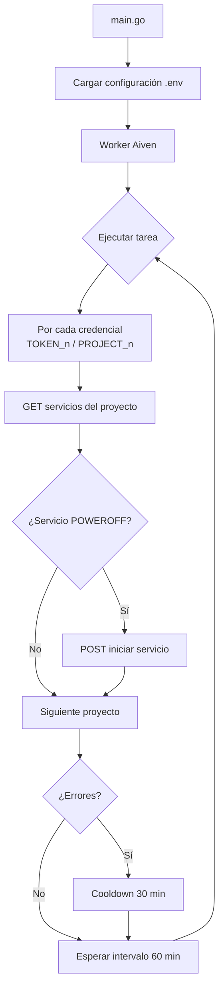

# Monitor Bot

> Bot de monitoreo y control de servicios en la nube, escrito en Go.

Bot de práctica que automatiza tareas de administración mediante workers programables (ejecución periódica con cooldown ante fallos). Actualmente gestiona servicios de **Aiven** en producción, con arquitectura limpia (puertos y adaptadores) preparada para nuevas integraciones.

---

## 📋 Índice

- [Estado actual](#-estado-actual)
- [Flujo del proyecto](#-flujo-del-proyecto)
- [Funcionalidades](#-funcionalidades)
- [Tecnologías](#-tecnologías)
- [Arquitectura](#-arquitectura)
- [Requisitos](#-requisitos)
- [Configuración](#-configuración)
- [Uso](#-uso)
- [Roadmap](#-roadmap)

---

## 🚦 Estado actual

| Módulo | Estado | Detalle |
|---|---|---|
| **Aiven** | 🟢 Activo | Worker en producción: revisa y enciende servicios apagados |
| **Aternos** | 🔴 Deshabilitado | Removido de `main` por problemas de headless y Cloudflare |
| **Logger** | 🟢 Activo | Sistema centralizado de logs estructurados |

> [!WARNING]
> El módulo de **Aternos** fue removido de `main` debido a bloqueos de **Cloudflare** en modo headless. Su código permanece en el repositorio (`internal/automation`, `internal/adapters`, `internal/minecraft`, `internal/services`) pendiente de revisión: se evaluará cambiarlo por otra estrategia o borrarlo en un futuro.

---

## 🔄 Flujo del proyecto



---

## ✨ Funcionalidades

| Funcionalidad | Módulo | Descripción |
|---|---|---|
| Worker programable | `internal/worker` | Ejecución periódica con intervalo, cooldown ante fallos y protección contra solapamiento de ciclos |
| Checker de Aiven | `internal/aiven` | Verifica el estado de los servicios por proyecto e inicia automáticamente los que estén en `POWEROFF` |
| Multi-proyecto | `internal/aiven` | Soporta múltiples proyectos Aiven en paralelo; un fallo en una API no aborta a las demás (`errors.Join`) |
| Logger centralizado | `internal/logger` | Logs estructurados con atributos y contexto por módulo |
| Manejo de señales | `cmd/main.go` | Apagado limpio con `SIGINT`/`SIGTERM` (Ctrl+C) |

### ⏸️ Funcionalidades pausadas (módulo Aternos)

| Funcionalidad | Módulo | Motivo de pausa |
|---|---|---|
| Ping a servidor Minecraft | `internal/minecraft` | Bloqueos de Cloudflare en modo headless |
| Automatización Playwright + Chromium | `internal/adapters` / `internal/automation` | Removido del flujo principal, pendiente de rediseño o eliminación |
| Sincronización de sesión vía GitHub Gist | `internal/adapters/github_gist` | Dependía del flujo del navegador de Aternos |

---

## 🛠️ Tecnologías

| Tecnología | Uso |
|---|---|
| [Go 1.24](https://go.dev/) | Lenguaje principal |
| [playwright-go](https://github.com/mxschmitt/playwright-go) | Automatización de navegador *(pausado)* |
| Chromium | Navegador controlado *(pausado)* |
| [go-mcping](https://github.com/iverly/go-mcping) | Ping a servidores Minecraft *(pausado)* |
| API REST Aiven | Gestión de servicios en la nube |
| Docker | Build multi-etapa para deploy |

---

## 🏗️ Arquitectura

Proyecto organizado bajo principios de **arquitectura limpia** (puertos y adaptadores):

```
cmd/
└── main.go               Aplicación CLI: orquesta los workers
internal/
├── config.go             Carga de .env y configuración raíz
├── config/               Configuraciones por módulo (en progreso)
├── logger/               Sistema de logging centralizado
├── ports/                Interfaces: BrowserManager, StateStorage
├── adapters/             Implementaciones: Playwright, GitHub Gist
├── automation/           Automatización del arranque del servidor
├── minecraft/            Verificación de estado por ping
├── services/             Capa de servicios (pipeline del bot)
├── worker/               Ejecución periódica de tareas (intervalo + cooldown)
└── aiven/                Cliente y checker para la API de Aiven
storage/                  Persistencia de sesión del navegador (state.json)
```

> Los módulos marcados como *pausados* en [Estado actual](#-estado-actual) no se ejecutan desde `main`, pero su código se mantiene para reutilizar la arquitectura en futuras integraciones.

---

## 📦 Requisitos

| Requisito | Versión | Notas |
|---|---|---|
| Go | 1.24+ | Obligatorio |
| Docker | — | Opcional, para deploy |
| Node.js + Chromium | — | Solo si se reactiva el módulo Aternos (`npx playwright install chromium`) |

---

## ⚙️ Configuración

Copia `.env.example` a `.env` y completa los valores.

### Variables activas (Aiven)

| Variable | Obligatoria | Descripción |
|---|:-:|---|
| `AIVEN_TOKEN_1` | ✅ | Token de API del proyecto Aiven 1 |
| `AIVEN_PROJECT_1` | ✅ | Nombre del proyecto Aiven 1 |
| `AIVEN_TOKEN_2`, `AIVEN_PROJECT_2` | ❌ | Proyectos adicionales (un índice por par) |
| `AIVEN_TOKEN`, `AIVEN_PROJECT` | ❌ | Variables legacy para un solo proyecto |

```env
AIVEN_TOKEN_1= token_api_aiven_1
AIVEN_PROJECT_1= nombre_proyecto_aiven_1
AIVEN_TOKEN_2= token_api_aiven_2
AIVEN_PROJECT_2= nombre_proyecto_aiven_2
```

### Variables pausadas (módulo Aternos)

| Variable | Descripción |
|---|---|
| `HOST` | Dirección del servidor de Minecraft |
| `PORT` | Puerto del servidor |
| `SERVER_ID` | ID del servidor en Aternos |
| `STORAGE_PATH` | Ruta del archivo de sesión (`storage/state.json`) |
| `HEADLESS` | Modo headless del navegador |
| `GITHUB_TOKEN` / `GIST_ID` | Sincronización de sesión vía Gist |

---

## 🚀 Uso

```sh
go run ./cmd
```

O con Docker:

```sh
docker build -t monitor-bot .
docker run --env-file .env monitor-bot
```

El bot arranca el **worker de Aiven**, que:

1. Ejecuta la verificación inmediatamente al iniciar.
2. Revisa cada **60 minutos** los servicios de cada proyecto configurado.
3. Enciende automáticamente los servicios que estén apagados (`POWEROFF`).
4. Si alguna llamada a la API falla, espera un **cooldown de 30 minutos** antes de reintentar.
5. Se detiene limpiamente con `Ctrl+C` (`SIGINT`/`SIGTERM`).

---

## 🗺️ Roadmap

- [ ] Rediseñar o eliminar el módulo de Aternos
- [ ] Soporte para otras plataformas de hosting
---

## 📄 Changelog

Historial de versiones disponible en [CHANGELOG.md](CHANGELOG.md).
