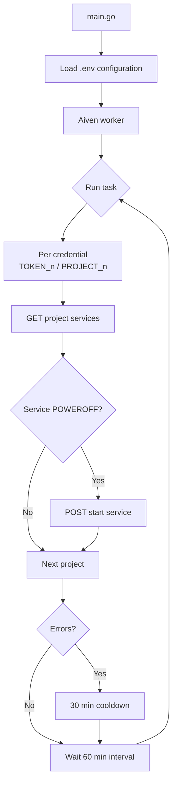

# Monitor Bot

> Cloud service monitoring and control bot written in Go.

Practice bot that automates administration tasks through programmable workers (periodic execution with cooldown on failures). Currently manages **Aiven** services in production, with a clean architecture (ports and adapters) ready for new integrations.

---

## 📋 Index

- [Current status](#-current-status)
- [Project flow](#-project-flow)
- [Features](#-features)
- [Technologies](#-technologies)
- [Architecture](#-architecture)
- [Requirements](#-requirements)
- [Configuration](#-configuration)
- [Usage](#-usage)
- [Roadmap](#-roadmap)

---

## 🚦 Current status

| Module | Status | Detail |
|---|---|---|
| **Aiven** | 🟢 Active | Production worker: checks and starts powered-off services |
| **Aternos** | 🔴 Disabled | Removed from `main` due to headless and Cloudflare issues |
| **Supabase** | 🟢 Active | Worker that monitors Supabase projects and restores inactive ones |
| **Logger** | 🟢 Active | Centralized structured logging system |

> [!WARNING]
> The **Aternos** module was removed from `main` due to **Cloudflare** blocks in headless mode. Its code remains in the repository (`internal/automation`, `internal/adapters`, `internal/minecraft`, `internal/services`) pending review: it will be replaced with another strategy or deleted in the future.

---

## 🔄 Project flow



---

## ✨ Features

| Feature | Module | Description |
|---|---|---|
| Programmable worker | `internal/worker` | Periodic execution with interval, cooldown on failures and protection against overlapping cycles |
| Aiven checker | `internal/aiven` | Checks service status per project and automatically starts those that are `POWEROFF` |
| Supabase checker | `internal/supabase` | Lists Supabase projects and restores those that are `INACTIVE` |
| Multi-project | `internal/aiven` | Supports multiple Aiven projects in parallel; an API failure does not abort the others (`errors.Join`) |
| Centralized logger | `internal/logger` | Structured logs with attributes and per-module context |
| Signal handling | `cmd/main.go` | Clean shutdown with `SIGINT`/`SIGTERM` (Ctrl+C) |
| Dynamic worker activation | `internal/config` | Enables each worker via environment variables (`*_ENABLED`) |

### ⏸️ Paused features (Aternos module)

| Feature | Module | Pause reason |
|---|---|---|
| Minecraft server ping | `internal/minecraft` | Cloudflare blocks in headless mode |
| Playwright + Chromium automation | `internal/adapters` / `internal/automation` | Removed from the main flow, pending redesign or removal |
| GitHub Gist session sync | `internal/adapters/github_gist` | Depended on the Aternos browser flow |

---

## 🛠️ Technologies

| Technology | Use |
|---|---|
| [Go 1.24](https://go.dev/) | Main language |
| [playwright-go](https://github.com/mxschmitt/playwright-go) | Browser automation *(paused)* |
| Chromium | Controlled browser *(paused)* |
| [go-mcping](https://github.com/iverly/go-mcping) | Minecraft server ping *(paused)* |
| Aiven REST API | Cloud service management |
| Supabase REST API | Supabase project management |
| Docker | Multi-stage build for deploy |

---

## 🏗️ Architecture

Project organized under **clean architecture** principles (ports and adapters):

```
cmd/
└── main.go               CLI application: orchestrates the workers
internal/
├── config/               Per-module configurations (pending refactor)
├── logger/               Centralized logging system
├── ports/                Interfaces: BrowserManager, StateStorage
├── adapters/             Implementations: Playwright, GitHub Gist
├── automation/           Server startup automation
├── minecraft/            Status check by ping
├── services/             Services layer (bot pipeline)
├── worker/               Periodic task execution (interval + cooldown)
├── aiven/                Client and checker for the Aiven API
└── supabase/             Client and checker for the Supabase API
storage/                  Browser session persistence (state.json)
```

> Modules marked as *paused* in [Current status](#-current-status) are not executed from `main`, but their code is kept to reuse the architecture in future integrations.

---

## 📦 Requirements

| Requirement | Version | Notes |
|---|---|---|
| Go | 1.24+ | Required |
| Docker | — | Optional, for deploy |
| Node.js + Chromium | — | Only if the Aternos module is reactivated (`npx playwright install chromium`) |

---

## ⚙️ Configuration

Copy `.env.example` to `.env` and fill in the values.

### Worker activation

Each worker can be independently enabled through a boolean environment variable.

| Variable | Description |
|---|---|
| `AIVEN_ENABLED` | Enables the Aiven worker (`true`/`false`) |
| `ATERNOS_ENABLED` | Enables the Aternos worker (`true`/`false`) |
| `SUPABASE_ENABLED` | Enables the Supabase worker (`true`/`false`) |

### Active variables (Aiven)

| Variable | Required | Description |
|---|:-:|---|
| `AIVEN_TOKEN_1` | ✅ | API token of Aiven project 1 |
| `AIVEN_PROJECT_1` | ✅ | Name of Aiven project 1 |
| `AIVEN_TOKEN_2`, `AIVEN_PROJECT_2` | ❌ | Additional projects (one index per pair) |
| `AIVEN_TOKEN`, `AIVEN_PROJECT` | ❌ | Legacy variables for a single project |

```env
AIVEN_TOKEN_1= token_api_aiven_1
AIVEN_PROJECT_1= nombre_proyecto_aiven_1
AIVEN_TOKEN_2= token_api_aiven_2
AIVEN_PROJECT_2= nombre_proyecto_aiven_2
```

### Active variables (Supabase)

| Variable | Required | Description |
|---|:-:|---|
| `SUPABASE_TOKEN` | ✅ | API token of Supabase |

### Paused variables (Aternos module)

| Variable | Description |
|---|---|
| `HOST` | Minecraft server address |
| `PORT` | Server port |
| `SERVER_ID` | Server ID in Aternos |
| `STORAGE_PATH` | Session file path (`storage/state.json`) |
| `HEADLESS` | Browser headless mode |
| `GITHUB_TOKEN` / `GIST_ID` | Session sync via Gist |

---

## 🚀 Usage

```sh
go run ./cmd
```

Or with Docker:

```sh
docker build -t monitor-bot .
docker run --env-file .env monitor-bot
```

The bot starts the enabled workers (Aiven, Supabase or Aternos), which:

1. Run the check immediately on startup.
2. Review the configured projects every **60 minutes**.
3. Automatically start services that are powered off (`POWEROFF`) / restore inactive projects.
4. If an API call fails, it waits a **30 minute cooldown** before retrying.
5. Stops cleanly with `Ctrl+C` (`SIGINT`/`SIGTERM`).

---

## 🗺️ Roadmap

- [ ] Redesign or remove the Aternos module
- [ ] Support for other hosting platforms

---

## 📄 Changelog

Version history available in [CHANGELOG.md](CHANGELOG.md).
